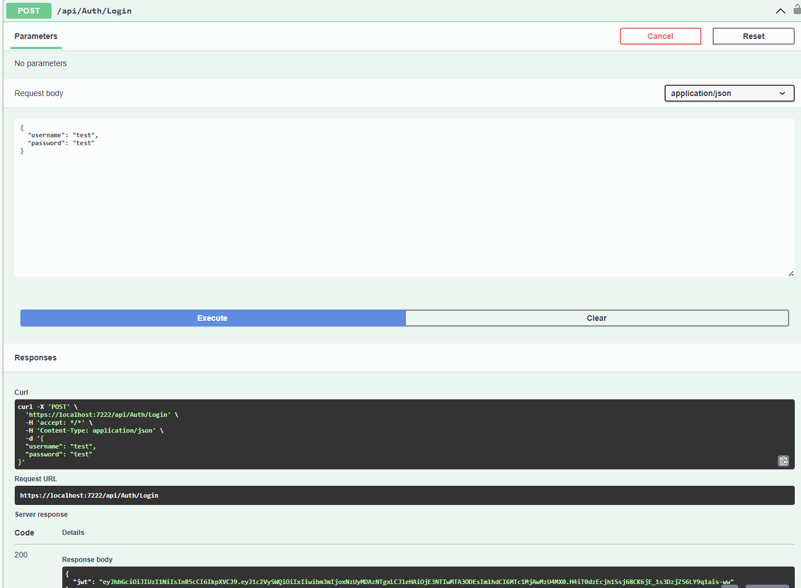
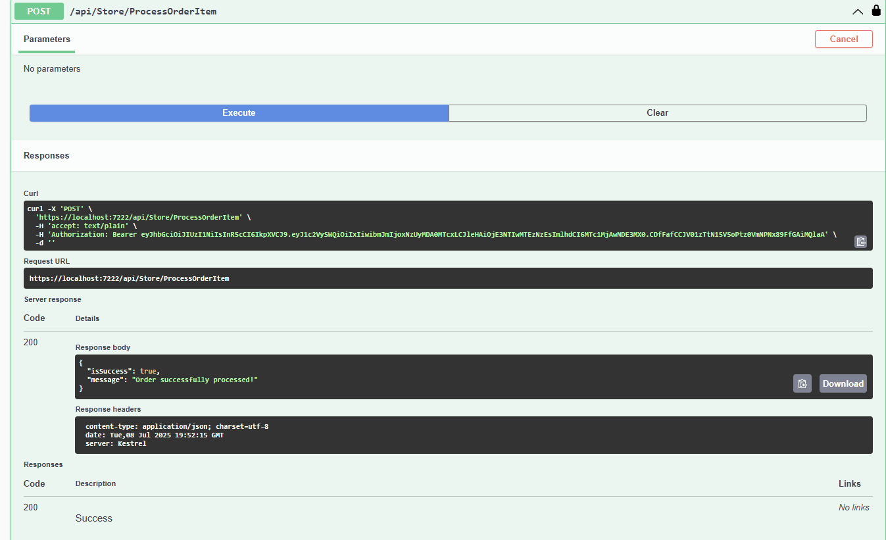

# 1. Clone the repository
git clone https://github.com/TeeSyong/AppleStoreRestfulApi.git
go into the project

# 2. Restore and Build the package manager dependencies
dotnet restore
dotnet build

# 3. Create a database named apple_store_db and create all the table and insert data using the SQL text file (I used MySQL from WAMPSERVER)

# 4. Change the appsetting.jsons connectionstring to your database info

# 5.  Then you are good to run go Run the project
dotnet run

# Assumption made in this project is that if customer buy 1 airpods he definitely will get another one by free doesn't matter he wants or not 

